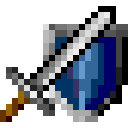

# Aldon's Crossing 

Play on [aldonscrossing.app](https://aldonscrossing.app/). Play in the browser or:

- On Android click menu, then add to home screen.
- On iPhone click share, then add to home screen.

## An open source re-implementation of Aldon's Crossing

Aldon's Crossing is a top down RPG game originally written for Palm PDA devices, a pre-iPhone series of mobile devices. You can find more about the original game [here](https://archive.org/details/tucows_216797_Aldon_s_Crossing); this is an open source re-implementation. The goal is to stay true to the original experience while allowing it to run on any screen size and on any platform with a webview. Its been tested on desktop Chrome, Android (Chrome), and iOS (Safari).

## Implementation

The game is split into into a backend and a front end (although both run on the client). The backend implements the core game while the frontend renders the game and implements the various dialogs in the game.

### Backend

Written in Rust™. Ultimately it is compiled to webassembly to run in the browser, but nothing in the backend should depend on that.

- **AldonGame:** The main entry point for interacting with game state.
- **Cast:** Owns game Actors and provides a simple async runtime for their state machines.
- **Actor:** Units of game behavior like treasure chests, signs, and monster bosses. Each actor has its own state machine described with a DSL.
- **Stage:** Manages the current map and all the bodies loaded on it.
- **Body:** Represents a physical thing in the game. Enemies have a body, items you can pick up have a body, the player has a body.
- **Resources:** Game resources like maps, actors, and strings are stored in "src/data/*.json" and are parsed into structs like ".*Res", e.g. SpellRes and PropRes

### Frontend

Draws game state to an html canvas. Dialogs are implemented as html web components.

- **AldonHtmlCanvasGame:** Entry point for adding Aldon's Crossing to a web view. Provides an api to manage the game from js, e.g. save a game.
- **main.js:** Setup wasm and the game. Most of the stuff in here should really live in AldonHtmlCanvasGame.
- **dialog.js:** Implements game dialogs like inventory, buy/sell, stats view in html/js/css.
- **menu.js:** Implements the drop down menu that mimics the old Palm system menu.

### Dev Dependencies

- Cargo
- [wasm-pack](https://github.com/rustwasm/wasm-pack)
- [Thrift](https://github.com/apache/thrift) 0.15.0
- [Task](https://github.com/go-task/task)
- [Prettier](https://prettier.io/)
